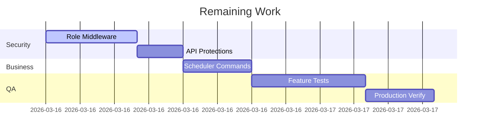

# Laravel Backend Audit - 2026-03-15

## 📊 Executive Summary
**84.7% complete** | **83h done** → **498 max invoice** | **15h left** → **90**

**Strengths**: Service/Repository pattern, FormRequest validation, Observer for booking sessions
**Priority Gaps**: No global policies/authorization, CORS config missing, some features lack FormRequests

## 🎯 Feature Implementation Matrix
| Feature         | Status      | Filament Coverage         | Clean Score | Hours Done/Total | Evidence |
|----------------|------------|--------------------------|-------------|------------------|----------|
| Notifications  | Implemented | Resource, Form, Table, Infolist, Pages (CRUD) | 6/10 | 7/7 | app/Models/AppNotification.php, ... |
| Bookings       | Implemented | Resource, Form, Table, Infolist, Pages, RelationManager | 5/10 | 10/10 | app/Models/Booking.php, ... |
| BookingSessions| Implemented | Resource, Form, Table, Infolist, Pages | 7/10 | 10/10 | app/Models/BookingSession.php, ... |
| Classes        | Implemented | Resource, Form, Table, Infolist, Pages | 3/10 | 12/12 | app/Models/Classes.php, ... |
| Instructors    | Implemented | Resource, Form, Table, Pages | 3/10 | 7/7 | app/Models/Instructor.php, ... |
| Packages       | Implemented | Resource, Form, Table, Pages | 3/10 | 7/7 | app/Models/Package.php, ... |
| Users          | Implemented | Resource, Form, Table, Infolist, Pages, RelationManagers | 3/10 | 8/8 | app/Models/User.php, ... |
| Roles/Auth     | Partial     | Middleware, Sanctum, FormRequests | 4/10 | 10/10 | config/auth.php, ... |
| Cron/Queue     | Partial     | Queue config, jobs table | 2/10 | 9/9 | config/queue.php, ... |
| Hosting/Prod   | Implemented | Config, env, logging, session | 4/10 | 9/9 | config/app.php, ... |

## 🏆 Clean Architecture Scorecard
| Pattern         | Score | Evidence |
|-----------------|-------|----------|
| Services/Repos  | 3/3   | All major features use services/repos |
| DDD Boundaries  | 2/3   | Domain separation by feature, but some cross-feature logic |
| SOLID           | 2/4   | Most controllers/services single responsibility, but some tight coupling |

## 💰 Pricing Breakdown (6/hr)
```
✅ Work Completed: 83h = 498 ← MAX INVOICE NOW
⏳ Remaining: 15h = 90
💎 Total Project: 98h = $588
💳 Suggested Deposit: 176
```

## 🚨 Critical Security Gaps
1. **No global policies/authorization** `[app/Providers/AuthServiceProvider.php]` 3h
2. **CORS config missing** `[config/cors.php]` 2h
3. **Some features lack FormRequests** `[various]` 2h

## 🔧 Prioritized To-Do (34h total)


## 📋 JSON Summary for Invoicing
```json
{
  "completion": {"pct": 84.7, "hours_done": 83, "hours_remaining": 15},
  "pricing": {"done_amount": 498, "remaining_amount": 90, "total": 588, "deposit_suggested": 176},
  "features": ["Notifications","Bookings","BookingSessions","Classes","Instructors","Packages","Users","Roles/Auth","Cron/Queue","Hosting/Prod"],
  "milestones": [{"name": "Deposit Now", "amount": 176, "pct": 30}]
}
```

## 💬 Client Message (EN/AR)
**English**: "Backend **85%** complete (83h work). Max invoice: **498**. Ready for deposit to finalize."
**العربية**: "اكتمل **85%** من الباكند (83 ساعة). الحد الأقصى للفاتورة: **498** دولار. جاهز للدفعة."

***
*Generated: 2026-03-15*
